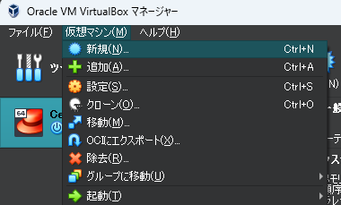
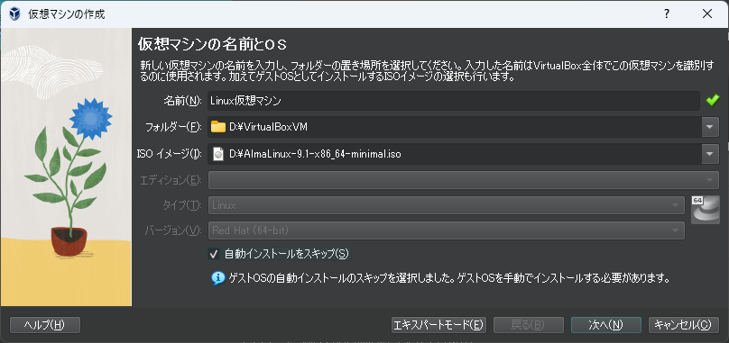

# VirtualBoxにAlmaLinuxを構築する

## VirtualBoxをインストールする

### VirtualBoxとは

いわゆる仮想PCと呼ばれるソフトで、通常使用しているWindowsやMac OSなどのPCの内部に仮想的にPCを作成します。  
その仮想PCにOSをインストールして使用することが可能で、WindowsPCの中にサーバの代用としてLINUXをインストールしたりします。  
仮想PCを使用することで物理的には1台のPCでもPCが複数台あるようにすることができます。  
また、仮想であるため仮に壊してしまっても復元が簡単です。

### VirtualBoxのダウンロード

 [https://www.oracle.com/jp/virtualization/technologies/vm/downloads/virtualbox-downloads.html](https://www.oracle.com/jp/virtualization/technologies/vm/downloads/virtualbox-downloads.html)からダウンロードできます。  
 インストールは特別な設定はなく、そのまま続行でよいと思います。

## AlmaLinuxのダウンロード

AlmaLinuxとは最近台頭している無料のLinuxです。  
商用として一番メジャーなLinuxがRedhat Linux(RHELと略されます)、無料版で一番メジャーなLinuxがCentOsというものがありましたがCentOsのサポートが終了してしまいました。
そのためCentOsの代わりに台頭しているのがAlmaLinuxとRockyLinuxの2つです。  
今回はAlmaLinuxをインストールしてみましょう。  

まずは[https://almalinux.org/ja/get-almalinux/](https://almalinux.org/ja/get-almalinux/)から最新バージョンをダウンロードします。

## 仮想Linux PC作成

VirtualBoxを起動します。  
画像は、`CentOs8`という名前の仮想PCがインストール済みの状態です。  

1. ここに新しい仮想PCを1つ追加してみましょう。  
     

   [仮想マシン]メニューから[新規作成]を選択してください。  

     

1. 新しく作成する仮想PCについての設定画面が表示されます。  
   
   | 項目名 | 説明 |
   |---|---|
   |名前|仮想マシンの名前を入力します。VirtualBoxで管理するためのものなので任意の名前で構いません。|
   |フォルダー|仮想マシン情報が保存されるフォルダーを選択します。任意の場所を選択してください。|
   |ISO イメージ|先ほどダウンロードしたAlmaLinuxのisoファイルを選択します。|
   |エディション|イメージファイルを選択すると自動判別してくれるため選択不要です。自動判別できない場合はインストールしようとしているOSの種類を選択します。|
   |タイプ|イメージファイルを選択すると自動判別してくれるため選択不要です。自動判別できない場合はインストールしようとしているOSの種類を選択します。|
   |バージョン|イメージファイルを選択すると自動判別してくれるため選択不要です。自動判別できない場合はインストールしようとしているOSのバージョンを選択します。|
   |自動インストール|インストールの自動化ができるようですが、今回は手動でインストールしてみましょう。|

1. 仮想PCに搭載されるメモリとCPUを設定します。  
     
   あまり大きな値を設定する必要はないので初期状態とします。  
   本体PCの性能に不安がある場合は、メモリを1024MBに下げても構いません。  

1. 仮想PCに搭載されるハードディスクの設定をします。  
     
   ディスクサイズはお好みで設定して構いませんが、16GB以上あればよいと思います。  
   本体PCの記憶容量と、Linuxで何をインストールするのかの予定などを考えて決めてください。  
   ここでは初期状態のまま20GBとします。  

1. 設定内容を確認します。  
     
   内容に問題がなければ`完了`を押下します。  

1. 作成完了です。  
     

## ネットワーク装置の設定

仮想PCのネットワーク装置の設定を行います。  
**この作業は必ずLinuxインストール前に実行してください。**

1. 設定画面を開きます。  
   

1. [ネットワーク]から[アダプター1]を選択して、画像の通りであることを確認します。  
   

1. [アダプター2]を画像の通りに設定します。  
   

## 仮想PCの起動～Linuxのインストール

では仮想PCを起動してみましょう。  

1. [Install Alma Linux]を選択して`Enter`を押します。  
   

1. 日本語を選択します。  
   

1. インストール先を設定します。  
     
   ハードディスクをチェックして[完了]を選択します。  
   

1. [ソフトウェアの選択]が[最小のインストール]となっていることを確認します。  
   

1. 下までスクロールして、rootユーザー（管理者ユーザー）のパスワードを設定します。  
     

   パスワードを設定して[完了]を選択します。**パスワードが脆弱な場合は２度選択する必要があります。**  
   

1. インストールを開始します。  
   rootではないユーザーの作成は後で実施するため不要です。  
     
   

1. 先ほど設定したrootユーザーでログインします。  
   

   画像のようになればログイン完了です。  
   

## TeraTermで接続

このまま直接仮想PCを操作してもよいのですが、VirtualBoxでは日本語がうまく表示されません。
そのためTeraTermで接続します。

### ユーザ作成

セキュリティを確保するため、rootユーザでは外部から接続できないよう設定します。  
仮想PCであるため本当の意味での外部からは接続できないのですが、Linuxの基礎ですので実施します。  
root以外のユーザを作成し、TeraTermではそのユーザでログインするようにしましょう。

1. `useradd <ユーザ名>` コマンドでユーザを作成します。  
   

1. `passwd <ユーザ名>` コマンドでパスワードを設定します。  
     
   パスワードが単純なものであったり、短いものだと画像のように警告が表示されますが、もう一度々パスワードを入力することで設定できます。  

1. 管理者権限を付与します。  
     
   作成したユーザーに管理者と同等の権限を付与します。  
   linuxにはrootユーザでなければ実行できないコマンドが多数ありますが、`sudo`というコマンドを使用することで、rootユーザの代わりに管理者用コマンドを実行することができます。  
   当然`sudo`コマンドは誰でも使用できるものではありませんが、`wheel`というグループに所属しているユーザであれば使用することができます。  
   `gpasswd -a <ユーザ名> wheel`とすることでユーザを`wheel`グループに所属させることができます。

### rootログイン禁止

この作業にはLinuxの設定ファイルを書き換える手順が含まれます。  
そのためには`vi`というコマンドを使用する必要があるのですが`vi`は操作方法が複雑で慣れが必要です。  
**以降の手順は特に正確に実施してください。大文字と小文字も正確に入力する必要があります。**  
**viコマンドの操作中になにかを間違えたり、状況がよくわからなくなったらこのページの最後付近にある「[vi作業の中止](#vi作業の中止)」を参照してください。**  

1. 設定ファイルのあるディレクトリまで移動します。  
   `cd /etc/ssh`コマンドで移動し、`pwd`コマンドで現在のディレクトリを確認します。  
   
1. `vi sshd_config`を実行します。  
   コマンドを実行すると以下のような画面になりますが、これが`vi`コマンドで開いた`sshd_config`ファイルの内容です。  
   
1. `/`を押して`RootLogin`と入力します。  
   `/`を押すことでvi用のコマンドを入力する状態になります。  `/`は文字列を検索するコマンドです。  
   画面の一番下に検索内容を入力できる状態になっていますので、画像の状態になったらEnterキーを押してください。  
     
   RootLoginという文字列が出現する場所まで画面がスクロールします。  
     
1. 検索結果の次の行に`PermitRootLogin no`を追記します。  
   検索結果の`#PermitRootLogin prohibit-password`の行でカーソルが点滅していることを確認し`o`を押します。  
   `o`を押すと現在の位置の次の行に新たな行を追加できる状態になります。  
     
   `PermitRootLogin no`と入力したら`Esc`を押してください。  
   最下行の`-- INSERT --`表示が消えて、入力モードではなくなります。  
   
1. 編集内容を保存してviを終了します。  
   `:`を押して`wq`を入力します。  
   `/`のときと同様に`:`もviのコマンドを入力するための機能です。  
   `wq`は保存して終了するためのコマンドです。  
     
1. 設定を反映させます。  
   `wq`コマンドを実行するとviが終了し、Linuxの画面に戻りますので`systemctl restart sshd`コマンドを実行します。  
   コマンドを実行しても何も起きていないように見えますが問題ありません。  
     

### TeraTermで接続してみる

1. ipアドレスを確認する  
  `ip a`コマンドを実行します。  
  赤枠の部分が仮想PCのIPアドレスとなります。  
    

1. TeraTermを起動しIPアドレスを入力します。  
   

1. セキュリティ警告で`続行`を選択します。  
     

1. ユーザ名とパスワードを入力します。  
   試しにrootユーザでログインしてみましょう。  
     
   ログインできません。  
     
   作成したユーザでログインしてみます。  
     
   無事ログインできました！  
     

### 作業を終了する

1. TeraTermで`exit`コマンドを実行します。  
   `exit`コマンドを実行するとTeraTermが切断され、自動的に終了します。  
   **ただし、`exit`コマンドは切断するだけで、仮想PC自体は起動したままです。**

1. `sudo shutdown now`コマンドでPCごとシャットダウンします。  
   `shutdown`コマンドを実行するとPCがシャットダウンされ、TeraTermも切断され自動終了します。その後、VirtualBoxを終了してください。  
   

### 日本語に設定する

1. デフォルトでは英語設定となっています。  
     

1. `sudo dnf -y install langpacks-ja glibc-langpack-ja.x86_64`を実行します。  
   

1. `sudo localectl set-locale LANG=ja_JP.UTF-8`を実行します。  
     

1. 一度TeraTermを終了して接続しなおすと日本語に対応しています。  
     

## vi作業の中止

viコマンドはWindowsとは異なりすべての操作がキーボード操作で、コマンドモード、入力モード、表示モードなど様々な状態があり、最初は現在どのような状況なのかわかりにくいです。  
またショートカットもたくさんあり、うっかり何かのキーを押してしまうとよくわからない結果になってしまうこともあります。  
そのような場合は慌てずに以下の操作を行い、ファイルを保存せずに閉じてしまいましょう。  
WindowsでいうところのCtrl+zのような機能もありますが、viに不慣れなうちは「*間違えたらやりなおす*」くらいのつもりのほうがよいです。  
設定ファイルなどは1文字のミスでアプリが動かなくなることもありえますので慎重に作業しましょう。

たとえば以下の画像のように、よくわからない文字を入力してしまい、もとに戻す方法がわからない場合の対処を記載します。  
  

1. モード表示が消えるまで`Esc`を押す  
   画面の一番下に`-- INSERT --`など表示がある場合があります。  
   これは現在文字入力モードであることを表しています。  
   まずはこの状態をとりやめましょう。  
     

1. `:`を押してコマンドモードにします。  
     

1. `q!`と入力して`Enter`を押します。  
   `q`が終了コマンドなのですが、viではファイルが編集されていて保存されていない場合エラーとなります。  
   `q!`とすることで保存していなくても強制的に終了することができます。
   その後、viコマンドからやりなおしましょう。  
     

## おわりに

ここまででWindowsPCに仮想のLinuxをインストールして**最低限**の環境設定がおわりました。  

### このあとにやること

このあとの作業としては、以下のものなどが推奨されますが、方法は各自調べて対応してください。  

* `dnf update`コマンドでインストール済みのアプリをすべてアップデートする
* VirtualBoxでスナップショットを作成し、いつでも特定の時点を復元できるようにする

### これからできること

いまの状況は、「PCを自作して、OSをインストールして、とりあえずネットワークにつながっている」という状態です。  
ここから何をやるかはすべて自分次第です。  
これは現実のPCでも仮想のPCでも、WindowsでもLinuxでも同じです。

シェルスクリプトを学ぶために使うも良し、データベースソフトをインストールするも良し、さまざまな学習に使用してください。  
学習のコツとして、「Linuxで何ができるか？Linuxの勉強ってなにをすればいいの？」というよりも「Linuxで◯◯をやるためにはどうすればよいの？」とテーマを決めて方法を調べるとよいです。  

例として思いつくだけでも、以下のものが挙げられます。

* LinuxにFTPでファイルをアップロードしたい
  * FTPのインストール、アクセス権の設定など
  * ファイヤーウォールの設定
* LinuxをWebサーバとしてホームページを作ってみたい
  * ApacheやNginxのインストール、
  * ファイヤーウォールの設定
* JavaやPHPで書いたプログラムを仮想Linuxで動かせるようにしたい
  * ApacheやNginxのインストール、
  * ファイヤーウォールの設定
  * データベースのインストール
* LinuxでPythonを動かしてみたい
  * おそらく何もしなくてもPythonコードがそのまま使えます
* 複数のディレクトリにたくさんのファイルがあるので、フォルダごとに圧縮したい
  * シェルスクリプトで圧縮する
  * １時間に１回など、自動で実行するよう設定する
* SubversionやGitなど、自分専用のリポジトリを作成したい
  * Subversionのインストール
  * GitLabやGitBucketのインストール
